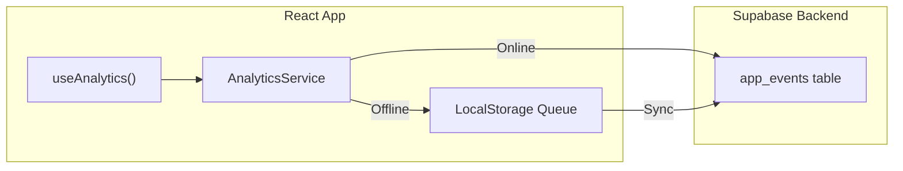

# Analytics System

This document describes the ONDA analytics system for tracking user behavior and product metrics.

## Overview

ONDA uses a privacy-first analytics approach:
- **All data stays in your Supabase database** — no third-party tracking
- **Offline support** — events are queued and synced when online
- **Typed events** — TypeScript ensures consistent event tracking

## Architecture



## Usage

### Basic Tracking

```typescript
import { useAnalytics } from './hooks/useAnalytics';

function MyComponent() {
  const { track, trackPractice, trackError } = useAnalytics();

  // Track simple events
  track('app_open', { platform: 'ios' });

  // Track practice events
  trackPractice('start', 'p1-1', { duration: 180 });
  trackPractice('complete', 'p1-1', { quality_score: 85 });

  // Track errors
  trackError('audio', 'Failed to load track', { url: '...' });
}
```

### Direct Service Access

```typescript
import { analytics, trackEvent } from './services/AnalyticsService';

// Direct function call
await trackEvent('sign_up', { method: 'email' });

// Identify user after sign-in
await analytics.identify(userId);

// Force flush queued events
await analytics.flush();
```

## Event Types

### Activation Events

| Event | Description | Metadata |
|-------|-------------|----------|
| `app_open` | App launched | `platform` |
| `onboarding_start` | User starts onboarding | — |
| `onboarding_step` | User views step | `step_number`, `step_name` |
| `onboarding_complete` | Onboarding finished | `duration_seconds` |
| `sign_up` | User created account | `method` |
| `sign_in` | User signed in | `method` |

### Permission Events

| Event | Description | Metadata |
|-------|-------------|----------|
| `health_permission_request` | Permission dialog shown | `permission_type` |
| `health_permission_granted` | User granted permission | `permission_type` |
| `health_permission_denied` | User denied permission | `permission_type` |
| `watch_connection_attempt` | Trying to connect watch | — |
| `watch_connection_success` | Watch connected | `heart_rate` |
| `watch_connection_failed` | Watch connection failed | `error` |

### Practice Events

| Event | Description | Metadata |
|-------|-------------|----------|
| `practice_view` | Practice screen opened | `practice_id`, `practice_name` |
| `practice_start` | Practice started | `practice_id`, `has_biometrics` |
| `practice_pause` | Practice paused | `practice_id`, `elapsed_time` |
| `practice_resume` | Practice resumed | `practice_id` |
| `practice_complete` | Practice finished | `practice_id`, `duration_seconds`, `quality_score`, `ond_earned` |
| `practice_abandon` | User quit early | `practice_id`, `elapsed_time` |

### Biometric Events

| Event | Description | Metadata |
|-------|-------------|----------|
| `heart_rate_received` | HR data received | `source`, `value` |
| `biometric_sync_success` | Data synced successfully | `source` |
| `biometric_sync_failed` | Sync failed | `source`, `error` |

### Gamification Events

| Event | Description | Metadata |
|-------|-------------|----------|
| `ond_earned` | User earned OND | `amount`, `source` |
| `artifact_unlocked` | New artifact obtained | `artifact_id` |
| `level_up` | User leveled up | `new_level` |

### Error Events

| Event | Description | Metadata |
|-------|-------------|----------|
| `error` | Generic error | `error_type`, `message` |
| `audio_load_error` | Audio failed to load | `url`, `error` |
| `api_error` | API call failed | `endpoint`, `status` |

## Database Schema

```sql
create table app_events (
  id uuid default gen_random_uuid() primary key,
  created_at timestamptz default now(),
  
  -- User identification
  user_id uuid references auth.users(id),
  anonymous_id text,     -- For pre-sign-in tracking
  session_id uuid,       -- Group events by session
  
  -- Event data
  event_name text not null,
  platform text,         -- 'ios', 'android', 'web', 'watchos'
  app_version text,
  metadata jsonb,
  
  -- Attribution
  utm_source text,
  utm_medium text,
  utm_campaign text
);
```

## Offline Support

Events are stored in `localStorage` when offline:

1. User triggers an event while offline
2. Event is added to local queue
3. When online, queue is flushed in batches
4. Successfully sent events are removed from queue

```typescript
// Queue structure in localStorage
const queue = [
  {
    id: 'uuid',
    event_name: 'practice_complete',
    metadata: { ... },
    timestamp: 1704456789000
  },
  // ...
];
```

## Attribution Tracking

UTM parameters are automatically captured:

```
https://app.onda.life?utm_source=facebook&utm_medium=cpc&utm_campaign=summer
```

These are stored with every event for attribution analysis.

## SQL Queries for Analysis

### Daily Active Users

```sql
select 
  date_trunc('day', created_at) as day,
  count(distinct user_id) as dau
from app_events
where created_at > now() - interval '30 days'
group by 1
order by 1;
```

### Practice Completion Funnel

```sql
with funnel as (
  select 
    user_id,
    max(case when event_name = 'practice_view' then 1 else 0 end) as viewed,
    max(case when event_name = 'practice_start' then 1 else 0 end) as started,
    max(case when event_name = 'practice_complete' then 1 else 0 end) as completed
  from app_events
  where created_at > now() - interval '7 days'
  group by 1
)
select 
  sum(viewed) as views,
  sum(started) as starts,
  sum(completed) as completions,
  round(100.0 * sum(started) / nullif(sum(viewed), 0), 1) as start_rate,
  round(100.0 * sum(completed) / nullif(sum(started), 0), 1) as completion_rate
from funnel;
```

### Average Practice Quality by Source

```sql
select 
  utm_source,
  count(*) as practices,
  round(avg((metadata->>'quality_score')::int), 1) as avg_quality
from app_events
where event_name = 'practice_complete'
  and created_at > now() - interval '30 days'
group by 1
order by 2 desc;
```

### Watch Connection Success Rate

```sql
select 
  date_trunc('day', created_at) as day,
  sum(case when event_name = 'watch_connection_success' then 1 else 0 end) as successes,
  sum(case when event_name = 'watch_connection_failed' then 1 else 0 end) as failures
from app_events
where event_name like 'watch_connection%'
  and created_at > now() - interval '14 days'
group by 1
order by 1;
```

## Future Improvements

1. **Meta Conversions API** — Edge Function to send conversion events to Facebook
2. **Metabase Dashboard** — Visual analytics dashboard
3. **Automated Alerts** — Notify on retention drops or error spikes
4. **Session Replay** — Consider PostHog for debugging UX issues

## See Also

- [Architecture Overview](./overview.md)
- [Supabase Migrations](../../supabase/migrations/)
