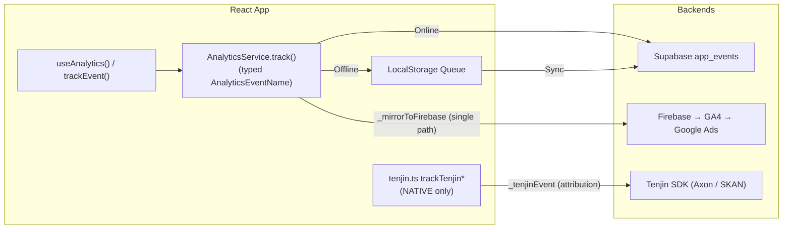

# Analytics System

This document describes the ONDA analytics system for tracking user behavior and product metrics.

## Overview

Every product event flows through **one typed wrapper** (`AnalyticsService.track()`)
and fans out to two sinks:

- **Supabase `app_events`** — first-party product analytics (funnels, retention),
  with an offline localStorage queue.
- **Firebase Analytics → GA4** — for Google Ads conversions / marketing. Mirrored
  from the same `track()` call. iOS via the Capacitor Firebase plugin; Android via
  `analytics-bridge`; web is a no-op.

Separately, **Tenjin** (`src/lib/tenjin.ts`, `trackTenjin*` helpers) sends **native**
MMP events (install attribution, AppLovin Axon, SKAdNetwork conversion values). These
are a *different* set of helpers with their own pooled `action_object` names and are
**not** the same as the Firebase events.

> **Single Firebase path (cleanup, cutover build 1.8.1 / 2026-06-13).** Firebase/GA4
> now receives events **only** through `AnalyticsService.track()`. Until then,
> `tenjin.ts` *also* mirrored every event into Firebase under a second naming
> convention, so each action landed in GA4 under two names (`start_practice` +
> `practice_start`, `view_paywall` + `paywall_view`, …). That Firebase mirror was
> removed; Tenjin native sends were left untouched. **Rule going forward:** the typed
> `AnalyticsEventName` enum is the single guard — add new events there and fire via
> `track()`; never open a second Firebase path. Variety goes in **params**, not names.

## Architecture



## Usage

### Basic Tracking

```typescript
import { useAnalytics } from './hooks/useAnalytics';

function MyComponent() {
  const { track, trackPractice, trackError } = useAnalytics();

  // Track simple events
  track('app_open', { platform: 'ios' });

  // Track practice events
  trackPractice('start', 'p1-1', { duration: 180 });
  trackPractice('complete', 'p1-1', { quality_score: 85 });

  // Track errors
  trackError('audio', 'Failed to load track', { url: '...' });
}
```

### Direct Service Access

```typescript
import { analytics, trackEvent } from './services/AnalyticsService';

// Direct function call
await trackEvent('sign_up', { method: 'email' });

// Identify user after sign-in
await analytics.identify(userId);

// Force flush queued events
await analytics.flush();
```

## Event Types

### Activation Events

| Event | Description | Metadata |
|-------|-------------|----------|
| `app_open` | App launched | `platform`, `cold_start` |
| `onboarding_start` | Onboarding begins — live one-screen first-run, or 3-screen tutorial replay | `source` (first_run\|menu), `featured_practice_id` / `att_copy_variant` |
| `onboarding_step` | Step view — **3-screen tutorial only** (the one-screen first-run has no steps) | `source` (menu), `step`, `total`, `permission` |
| `onboarding_complete` | Onboarding finished (was Tenjin `tutorial_complete`) | `source`, `completed_via` (cta\|skip — first_run only), `duration_seconds` |
| `sign_up` | User created account | `method` |
| `sign_in` | User signed in | `method` |

> **Canonical activation funnel** (filter `source = 'first_run'`): `first_open`
> (Firebase auto) → `onboarding_start` → `onboarding_complete` →
> `first_practice_complete` → `paywall_view` → `purchase`. The live new-install
> path is the one-screen first-run welcome. The legacy 3-screen tutorial is
> demoted to Menu → Intro and emits the same events with `source: 'menu'`, so
> manual replays stay OUT of the new-user funnel. `first_run_welcome_*` was
> folded in: the view = `onboarding_start`, the cta/skip outcome = `completed_via`.

### Permission Events

| Event | Description | Metadata |
|-------|-------------|----------|
| `health_permission` | HealthKit prompt resolved (deduped by granted-state — see note) | `scope`, `granted` |
| `att_prompt_result` | ATT prompt resolved | `status` |
| `notification_prompt_result` | Notification prompt resolved | `status` |
| `onboarding_permission_screen_view` | Permission screen shown | — |
| `watch_connection_attempt` | Trying to connect watch | — |
| `watch_connect_success` | Watch connected | `heart_rate`, `is_connected` |
| `watch_connection_failed` | Watch connection failed | `error` |

> `health_permission` is deduped by the granted state (localStorage
> `onda_health_perm_logged`) because two HealthKit hooks re-check authorization —
> without the guard it fired ~15×/user. The Tenjin native side still fires per
> call (attribution).

### Practice Events

| Event | Description | Metadata |
|-------|-------------|----------|
| `practice_start` | Practice started | `practice_type` (standard\|adaptive), `practice_id`, `has_biometrics` |
| `practice_pause` | Practice paused | `practice_id` |
| `practice_resume` | Practice resumed | `practice_id` |
| `practice_complete` | Practice finished | `practice_type`, `practice_id`, `duration_seconds`, `quality_score`, `ond_earned` |
| `practice_abandon` | Left without completing | `practice_type`, `practice_id`, `reason` (stop\|close\|incomplete) |
| `first_practice_complete` | First-ever valid completion (value-moment; fires once) | `practice_type` |

> **`practice_view` retired** (folded into `practice_start` — the counts were
> near-identical). **Adaptive vs standard is the `practice_type` param**, never a
> separate `*_adaptive_practice` event. The Tenjin native side keeps its pooled
> `start_practice`/`finish_practice` (+ per-practice slugs) for Axon.

### Biometric Events

| Event | Description | Metadata |
|-------|-------------|----------|
| `heart_rate_received` | HR data received | `source`, `value` |
| `biometric_sync_success` | Data synced successfully | `source` |
| `biometric_sync_failed` | Sync failed | `source`, `error` |

### Gamification Events

| Event | Description | Metadata |
|-------|-------------|----------|
| `ond_earned` | User earned OND | `amount`, `source` |
| `artifact_unlocked` | New artifact obtained | `artifact_id` |
| `level_up` | User leveled up | `new_level` |

### Paywall / Monetization Events

| Event | Description | Metadata |
|-------|-------------|----------|
| `paywall_view` | Subscription screen opened | `source` |
| `paywall_dismiss` | Closed without subscribing | `source`, `plan`, `time_on_screen_seconds` |
| `paywall_cta_tap` | Tapped the purchase CTA | `plan`, `product_id` |
| `trial_start` | Free trial started ($0 at Apple) | `product_id`, `plan` |
| `purchase` | Real paid conversion — Firebase **ecommerce**, keep this name | `value`, `currency`, `product_id`, `plan` |
| `purchase_failed` | Purchase threw | `plan`, `error` |
| `purchase_cancelled` | User cancelled the StoreKit sheet | `plan` |

> `purchase` fires from `useSubscription` **only on a genuine not-paid → paid
> (NORMAL) transition** — never on restore, login-restore, reinstall (pre-existing
> sub on first load), or renewal (active→active with only the date moved). Those
> are recorded as a paid-state baseline (`onda_sub_paid_state`) instead; renewals
> are counted server-side as `subscription_renew` via the RevenueCat webhook. The
> off-app trial→paid flip still counts, because the baseline persists across
> launches. Keep the name `purchase` + `value`/`currency` so GA4 counts it as
> revenue. Trial start ($0) is `trial_start`, never `purchase` (old phantom bug).

### Diagnostics Events

| Event | Description | Metadata |
|-------|-------------|----------|
| `app_crash_suspected` | Stale practice marker found on next launch (iOS WebView OOM) | — |
| `practice_intro_closed_debug` | **dev-only** — dropped in prod | … |
| `resource_snapshot` | **dev-only** — memory snapshot, dropped in prod | … |

> `practice_intro_closed_debug` and `resource_snapshot` are gated behind
> `const ANALYTICS_DEBUG = false` in `AnalyticsService.ts` and never reach
> Firebase/Supabase in prod (they were leaking ~214 events/build into GA4). Flip
> the flag locally to re-enable.

### Error Events

| Event | Description | Metadata |
|-------|-------------|----------|
| `error` | Generic error | `error_type`, `message` |
| `audio_load_error` | Audio failed to load | `url`, `error` |
| `api_error` | API call failed | `endpoint`, `status` |

## Database Schema

```sql
create table app_events (
  id uuid default gen_random_uuid() primary key,
  created_at timestamptz default now(),
  
  -- User identification
  user_id uuid references auth.users(id),
  anonymous_id text,     -- For pre-sign-in tracking
  session_id uuid,       -- Group events by session
  
  -- Event data
  event_name text not null,
  platform text,         -- 'ios', 'android', 'web', 'watchos'
  app_version text,
  metadata jsonb,
  
  -- Attribution
  utm_source text,
  utm_medium text,
  utm_campaign text
);
```

## Offline Support

Events are stored in `localStorage` when offline:

1. User triggers an event while offline
2. Event is added to local queue
3. When online, queue is flushed in batches
4. Successfully sent events are removed from queue

```typescript
// Queue structure in localStorage
const queue = [
  {
    id: 'uuid',
    event_name: 'practice_complete',
    metadata: { ... },
    timestamp: 1704456789000
  },
  // ...
];
```

## Attribution Tracking

UTM parameters are automatically captured:

```
https://app.onda.life?utm_source=facebook&utm_medium=cpc&utm_campaign=summer
```

These are stored with every event for attribution analysis.

## SQL Queries for Analysis

### Daily Active Users

```sql
select 
  date_trunc('day', created_at) as day,
  count(distinct user_id) as dau
from app_events
where created_at > now() - interval '30 days'
group by 1
order by 1;
```

### Practice Completion Funnel

```sql
-- practice_view was retired; the funnel now runs start → complete.
with funnel as (
  select 
    user_id,
    max(case when event_name = 'practice_start' then 1 else 0 end) as started,
    max(case when event_name = 'practice_complete' then 1 else 0 end) as completed
  from app_events
  where created_at > now() - interval '7 days'
  group by 1
)
select 
  sum(started) as starts,
  sum(completed) as completions,
  round(100.0 * sum(completed) / nullif(sum(started), 0), 1) as completion_rate
from funnel;
```

### Average Practice Quality by Source

```sql
select 
  utm_source,
  count(*) as practices,
  round(avg((metadata->>'quality_score')::int), 1) as avg_quality
from app_events
where event_name = 'practice_complete'
  and created_at > now() - interval '30 days'
group by 1
order by 2 desc;
```

### Watch Connection Success Rate

```sql
select 
  date_trunc('day', created_at) as day,
  sum(case when event_name = 'watch_connect_success' then 1 else 0 end) as successes,
  sum(case when event_name = 'watch_connection_failed' then 1 else 0 end) as failures
from app_events
where event_name in ('watch_connect_success', 'watch_connection_failed', 'watch_connection_attempt')
  and created_at > now() - interval '14 days'
group by 1
order by 1;
```

## Future Improvements

1. **Meta Conversions API** — Edge Function to send conversion events to Facebook
2. **Metabase Dashboard** — Visual analytics dashboard
3. **Automated Alerts** — Notify on retention drops or error spikes
4. **Session Replay** — Consider PostHog for debugging UX issues

## See Also

- [Architecture Overview](./overview.md)
- [Supabase Migrations](../../supabase/migrations/)
