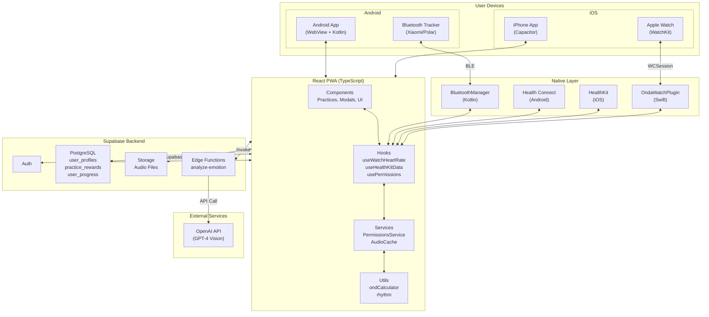
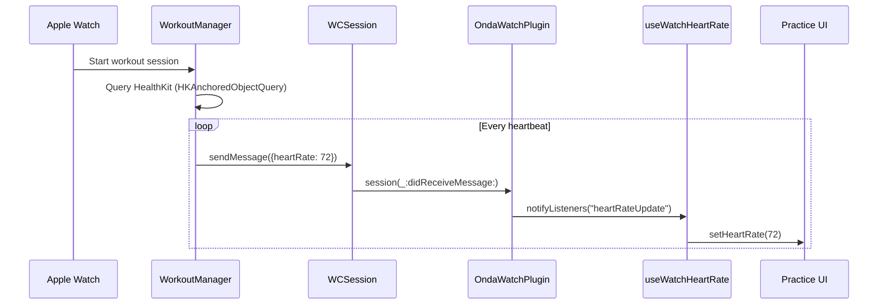
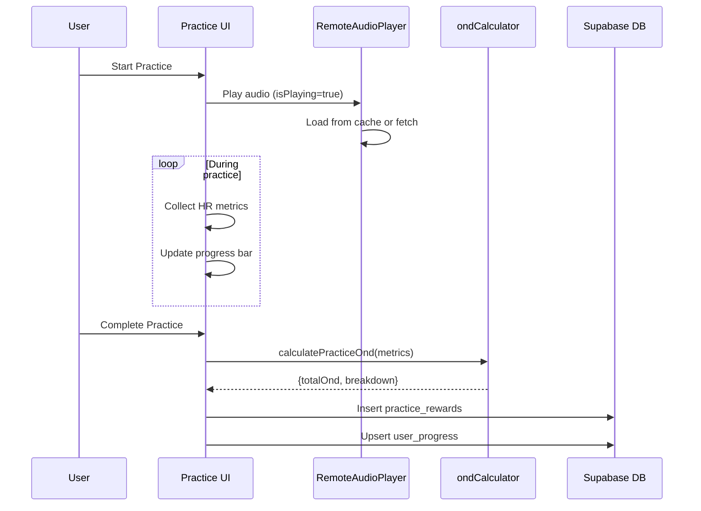
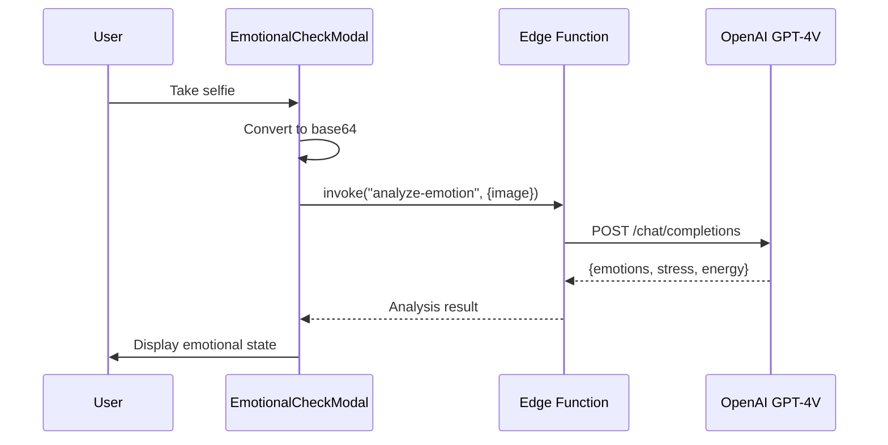

# Architecture Overview

This document provides a high-level overview of the ONDA Life system architecture.

## System Diagram

## Component Overview

### Frontend (React PWA)

| Component | Purpose | Key Files |
|-----------|---------|-----------|
| **Components** | UI elements, practice screens, modals | `src/components/`, `src/onda-level1-demo_27.tsx` |
| **Hooks** | State management, native bridge | `src/hooks/useWatchHeartRate.ts`, `useHealthKitData.ts` |
| **Services** | Business logic, permissions | `src/services/PermissionsService.ts` |
| **Utils** | Calculations, helpers | `src/utils/ondCalculator.ts`, `src/sleep/rhythm.ts` |

### Native Layer

| Platform | Component | Purpose |
|----------|-----------|---------|
| **iOS** | `OndaWatchPlugin.swift` | Bridge between React and Watch via WCSession |
| **iOS** | `WorkoutManager.swift` | Heart rate monitoring on Watch |
| **Android** | `HealthConnectManager.kt` | Health Connect integration |
| **Android** | `BluetoothManager.kt` | BLE tracker connection |

### Backend (Supabase)

| Service | Purpose |
|---------|---------|
| **Auth** | User authentication (email, OAuth) |
| **PostgreSQL** | User data, practice history, rewards |
| **Storage** | Audio files for practices (~500MB) |
| **Edge Functions** | Emotion analysis via OpenAI |

---

## Data Flows

### 1. Heart Rate Monitoring (Apple Watch)

### 2. Practice Execution Flow

### 3. Emotion Analysis Flow

---

## Tech Stack Summary

| Layer | Technology | Version |
|-------|------------|---------|
| **Frontend** | React | 18.x |
| **Language** | TypeScript | 5.x |
| **Build** | Vite | 5.x |
| **Styling** | TailwindCSS | 3.x |
| **iOS Wrapper** | Capacitor | 6.x |
| **iOS Native** | Swift | 5.x |
| **watchOS** | WatchKit + HealthKit | watchOS 9+ |
| **Android Wrapper** | WebView | - |
| **Android Native** | Kotlin | 1.9.x |
| **Backend** | Supabase | - |
| **Database** | PostgreSQL | 15.x |
| **AI** | OpenAI GPT-4 Vision | - |

---

## Key Architecture Decisions

### Why Capacitor + WebView?

- **Single codebase** for iOS and Android
- **Native access** when needed (HealthKit, Watch, Bluetooth)
- **Fast iteration** — web updates don't require app store review

### Why Supabase?

- **All-in-one** backend (auth, db, storage, functions)
- **Real-time** capabilities for future features
- **PostgreSQL** with Row Level Security

### Why Watch uses Workout Session?

- **Background execution** — keeps app alive when screen is off
- **Continuous HR** — HKAnchoredObjectQuery provides real-time data
- **Battery optimized** — Apple's recommended approach

---

## See Also

- [Heart Rate Integration](./heart-rate-integration.md) — Detailed HR implementation
- [Permissions Solution](./permissions-solution.md) — Permission handling architecture
- [HealthKit Solution](./healthkit-solution.md) — iOS health data integration
