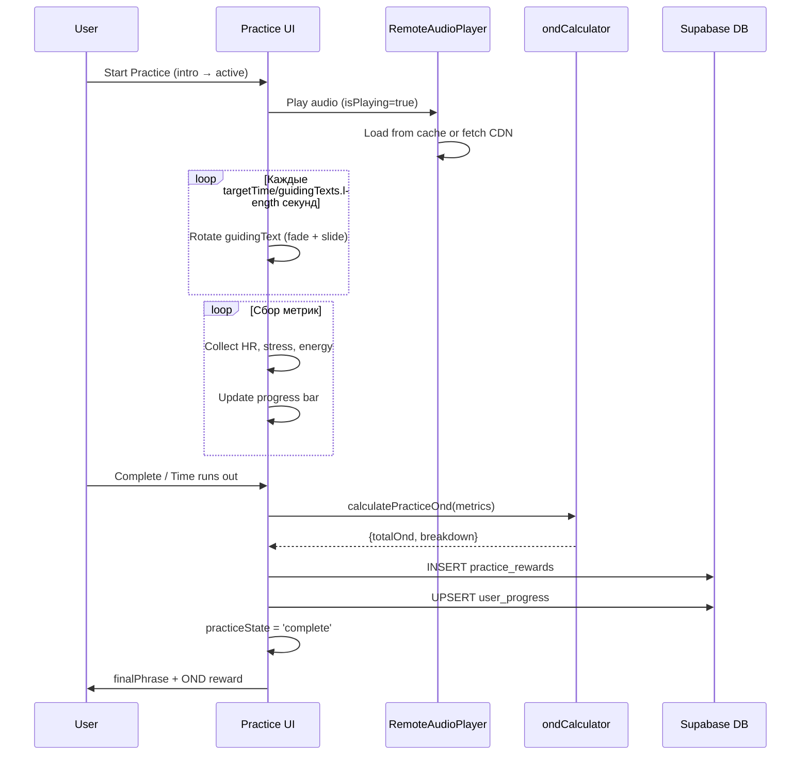

# Архитектура практик ONDA

Все практики в приложении делятся на два принципиально разных типа: **базовые (контурные)** и **адаптивные**.

---

## 1. Базовые практики (Circuit Practices)

### Что это

Практики, организованные в **контуры (circuits)** — прогрессивные уровни прохождения приложения.  
Текущие контуры: p1 (TERRA) · p2 (AQUA) · p3 (TERRA-II) · p4 (AQUA-II) · p5 (IGN) · p6+  
Каждый контур = 12 практик.

### Где описываются

| Что | Файл | Строки |
|-----|------|--------|
| Runtime-конфиг (визуал, длительность, тексты) | `src/onda-level1-demo_27.tsx` → `practiceSpaces` | ~877–1600 |
| Карточки UI (название, описание, maxQnt) | `src/onda-level1-demo_27.tsx` → `circuits[].practices[]` | ~1640–1750 |
| Текстовый контент (все языки) | `public/locales/{lang}/translation.json` | — |
| Рендеринг во время практики | `src/onda-level1-demo_27.tsx` → `practiceState === 'active'` | ~3542 |
| Рендеринг интро-экрана | `src/onda-level1-demo_27.tsx` → `practiceState === 'intro'` | ~3485 |
| Панорама (WebGL EXR) | `src/components/WelcomeScene.tsx` | — |
| Карты EXR/JPEG | `src/constants/practiceAssets.ts` | — |

### Поля `practiceSpaces` (runtime-конфиг)

```typescript
practiceSpaces: {
  'p1-1': {
    colors: string,          // TailwindCSS-градиент — фон-fallback если нет EXR
    element: string,         // 'TERRA' | 'AQUA' | 'IGN' | ...
    elementMessage: string,  // i18n: practice_messages.{key}
    ambientSound: string,    // i18n: elements.{key}
    visual: string,          // emoji, отображается на интро-экране
    targetTime: number,      // длительность в секундах
    guidingTexts: string[],  // i18n: guiding_texts.{p1_1} (массив)
    finalPhrase: string,     // i18n: final_phrases.{p1_1}
    scienceInfo?: string[],  // i18n: science_info.{p4_1} — ТОЛЬКО p4 и p5
  }
}
```

### Поля карточки UI (circuits[].practices[])

```typescript
{
  id: string,       // 'p1-1', 'p2-3', ...
  name: string,     // i18n: practice_items.{slug}
  duration: string, // i18n: practice_items.duration_3min / duration_6min / ...
  maxQnt: number,   // максимальная награда OND
  desc: string,     // i18n: practice_items.{slug}_desc
}
```

### Длительности и maxQnt по контурам

| Контур | Длительность p1–8 | Длительность p9–10 | Длительность p11–12 | maxQnt диапазон |
|--------|--------------------|---------------------|----------------------|-----------------|
| p1 (TERRA) | 3 мин (180s) | 6 мин (360s) | 12 мин (720s) | 10–30 OND |
| p2 (AQUA) | 10–30 мин | 10–12 мин | 11–12 мин | 55–80 OND |
| p3 (TERRA-II) | 6–10 мин | 9–12 мин | 12 мин | 50–80 OND |
| p4 (AQUA-II) | 6 мин (360s) | 6 мин | 6 мин | 55–75 OND |
| p5 (IGN) | 6 мин | 6–10 мин | 10–12 мин | 50–80 OND |

### EXR-панорама (WebGL)

Компонент `WelcomeScene` рендерит 360° HDR-панораму через Three.js (HalfFloatType, совместимо с iOS).

**Покрытие:** 3 файла EXR на 36 практик (p1, p2, p3):

| EXR-файл | Покрывает |
|----------|-----------|
| `hdr_p1/exr_p1_01.exr` | p1-1 … p1-12 |
| `hdr_p2/exr_p2_01.exr` | p2-1 … p2-12 |
| `hdr_p3/exr_p3_01.exr` | p3-1 … p3-12 |

**p4, p5, p6+** — без EXR, отображается градиентный фон из поля `colors`.

JPEG-превью (плейсхолдер пока грузится EXR) — один файл для всех практик, описан в `src/constants/practiceAssets.ts`.

### Логика ротации guidingTexts

Тексты меняются автоматически по времени:
```
интервал = targetTime / guidingTexts.length
```
Переход — fade + slide-вверх, длительность 1 сек.  
В **minimal mode** (пользователь нажал «свернуть») виден только текущий текст в нижнем блоке; нажатие на блок возвращает полный интерфейс.

### scienceInfo — только p4 и p5

На интро-экране p4/p5 дополнительно показывается блок с научным обоснованием практики.  
Формат: массив строк вида `"Biology: ..."` / `"Neuroscience: ..."`.

### Аудио-контент (базовые практики)

Файлы хранятся в Supabase Storage CDN. Путь:
```
p{N}/p{N}-{M}_{PracticeEnName}/{PracticeEnName}-{trackN}.mp3
```
Пример:
```
p1/p1-1_Breath of Life/p1-1_Breath of Life-1.mp3
p1/p1-8_Breath Count/p1-8_Breath Count-1.mp3
p1/p1-8_Breath Count/p1-8_Breath Count-2.mp3   ← некоторые имеют несколько треков
```
Подробнее: [`docs/guides/audio-cdn-setup.md`](../guides/audio-cdn-setup.md), [`docs/guides/upload-large-files.md`](../guides/upload-large-files.md).

---

## 2. Адаптивные практики (Adaptive Practices)

### Что это

18 коротких практик, не привязанных к контуру. Предназначены для ситуативного применения — тревога, усталость, потребность в моменте покоя. Показываются через отдельный UI (не из экрана контура).

### Где описываются

| Что | Файл |
|-----|------|
| Конфиг (все 18 практик) | `src/components/AdaptivePracticeModal.tsx` → `adaptivePractices` |
| Текстовый контент | `public/locales/{lang}/translation.json` → ключ `adaptive_practices.{slug}.*` |
| UI рендеринг | `src/components/AdaptivePracticeModal.tsx` |

### Список практик

| Slug | Название (EN) |
|------|---------------|
| `body_cocoon` | Body Cocoon |
| `light_inhale` | Light Breath |
| `inner_spark` | Inner Spark |
| `slow_glow` | Slow Glow |
| `earth_breath` | Earth Breath |
| `wave_pulse` | Wave Pulse |
| `sphere_breath` | Sphere Breath |
| `light_flow` | Light Flow |
| `roots_breath` | Roots Breath |
| `earth_pulse` | Earth Pulse |
| `breath_possibility` | Breath of Possibility |
| `inner_smile` | Inner Smile |
| `amoeba_dance` | Amoeba Dance |
| `warm_sphere` | Warm Sphere |
| `rest_breath` | Rest Breath |
| `silence_point` | Point of Stillness |
| `listen_space` | Listen to Space |
| `still_form` | Still Form |

### Поля конфига адаптивной практики

```typescript
{
  id: string,           // совпадает со slug
  element: string,      // 'TERRA' | 'AQUA' | ...
  visual: ReactNode,    // emoji
  name: string,         // i18n-ключ: 'adaptive_practices.body_cocoon.name'
  shortPhrase: string,  // ⚡ дополнительное поле, отсутствует в базовых!
                        // i18n-ключ: 'adaptive_practices.body_cocoon.short_phrase'
  guidingTexts: string[], // массив i18n-ключей: ['adaptive_practices.body_cocoon.guiding_1', ...]
  finalPhrase: string,  // i18n-ключ
  targetTime: number,   // преимущественно 360s (6 мин)
  maxOnd: number,       // единое значение: 50 для всех
  ambientSound: string, // i18n-ключ
  audioSrc: string[],   // массив mp3-путей (несколько треков — выбор случайный)
}
```

### Аудио-контент (адаптивные практики)

Файлы в отдельной папке на Supabase Storage:
```
Anxiety/adaptive-{slug}/adaptive-{slug}-{N}.mp3
```
Пример:
```
Anxiety/adaptive-body_cocoon/adaptive-body_cocoon-1.mp3
Anxiety/adaptive-body_cocoon/adaptive-body_cocoon-2.mp3
Anxiety/adaptive-body_cocoon/adaptive-body_cocoon-3.mp3
Anxiety/adaptive-body_cocoon/adaptive-body_cocoon-4.mp3
```
Каждая адаптивная практика имеет от 3 до 6 вариантов трека.

### i18n-структура (в translation.json)

```json
"adaptive_practices": {
  "start": "Start Practice",
  "complete_title": "Practice Complete",
  "body_cocoon": {
    "name": "Body Cocoon",
    "short_phrase": "Hug yourself. Create a warm shell of safety.",
    "guiding_1": "Hug your shoulders or torso...",
    "guiding_2": "...",
    "final_phrase": "You are safe."
  }
}
```
Ключи guiding-текстов — **пронумерованные** (`guiding_1`, `guiding_2`, ...), не массив.

---

## Сравнительная таблица

| Параметр | Базовые (p1–p6+) | Адаптивные |
|----------|-----------------|------------|
| Количество | 72 (6 контуров × 12) | 18 |
| Конфиг | `practiceSpaces` в main component | `adaptivePractices` в `AdaptivePracticeModal.tsx` |
| Привязка к контуру | Да | Нет |
| EXR-панорама | Только p1/p2/p3 | Нет (всегда градиент) |
| scienceInfo | Только p4/p5 | Нет |
| shortPhrase | Нет | Да |
| maxOnd | Индивидуальный (10–80) | Единый: 50 |
| Длительность | 3–30 мин | Преимущественно 6 мин |
| i18n guiding-ключ | `guiding_texts.p1_1` (массив) | `adaptive_practices.slug.guiding_N` (по одному) |
| Аудио-путь | `p{N}/p{N}-{M}_{Name}/...` | `Anxiety/adaptive-{slug}/...` |
| Треков на практику | 1–2 | 3–6 |

---

## i18n-конвенция именования

| Ключ | Формат | Пример |
|------|--------|--------|
| Название практики | `practice_items.{slug}` | `practice_items.micro_breath` |
| Описание карточки | `practice_items.{slug}_desc` | `practice_items.micro_breath_desc` |
| Длительность | `practice_items.duration_{N}min` | `practice_items.duration_3min` |
| Guiding-тексты | `guiding_texts.{pN_M}` | `guiding_texts.p1_1` (подчёркивание, не дефис!) |
| Финальная фраза | `final_phrases.{pN_M}` | `final_phrases.p1_1` |
| Научный контекст | `science_info.{pN_M}` | `science_info.p4_1` |
| Слоган элемента | `practice_messages.{key}_message` | `practice_messages.breath_message` |
| Звук | `elements.{key}` | `elements.breath` |

---

## Flow выполнения практики



---

## Расчёт OND-награды

**Файл:** `src/utils/ondCalculator.ts`  
**Вызов:** `calculatePracticeOnd(metrics)` при завершении практики.

### Входные данные

```typescript
interface PracticeMetrics {
  actualDurationSeconds: number;    // сколько реально прошло
  expectedDurationSeconds: number;  // targetTime практики
  stressBefore: number | null;      // стресс в начале (0–100)
  stressAfter: number | null;       // стресс в конце (лучшее значение за практику)
  energyBefore: number | null;      // энергия в начале (0–100)
  energyAfter: number | null;       // энергия в конце (лучшее значение за практику)
  baseOndReward: number;            // maxQnt из карточки практики
  hasRealMetrics: boolean;          // true = данные от реального датчика
}
```

> **Важно: «лучшие метрики»** — используется не финальное значение, а лучшее за всё время практики:
> `finalStress = min(bestMetrics.stress, currentStress)` — минимальный стресс  
> `finalEnergy = max(bestMetrics.energy, currentEnergy)` — максимальная энергия  
> Это защищает от потери OND при временном ухудшении показателей.

### Формула (одинакова для обоих режимов)

```
completionOnd  = baseOnd × 0.15 × min(actualTime / targetTime, 1)
stressOnd      = baseOnd × 0.40 × min((stressBefore - stressAfter) / stressBefore / 0.10, 1)
energyOnd      = baseOnd × 0.45 × min((energyAfter - energyBefore) / energyBefore / 0.10, 1)

totalOnd = completionOnd + stressOnd + energyOnd
```

| Составляющая | Вес | За что |
|--------------|-----|--------|
| Completion | 15% | Провёл время до конца |
| Stress | 40% | Снижение стресса (цель: −10%) |
| Energy | 45% | Рост энергии (цель: +10%) |

Полная награда = totalOnd × (1 + artifactBonus / 100).

### Режим С трекером (`hasRealMetrics = true`)

**Условие:** `vitalsRef.current.hasVitalsData === true` — подключён Apple Watch, Bluetooth HRM или Health Connect и данные поступают.

- `initialStress` / `initialEnergy` — реальные значения из датчика на момент старта
- `finalStress` / `finalEnergy` — лучшие реальные значения за время практики
- `isSimulated: false` в результате
- Даёт максимально точную награду

### Режим БЕЗ трекера (`hasRealMetrics = false`)

**Условие:** нет подключённого датчика.

Два подслучая:

**A. Есть значения из UI-слайдеров** (`stressBefore/energyBefore` заданы, но не от датчика):  
→ Формула та же, `isSimulated: true`. Пользователь сам задаёт начальные значения (default 50/50).

**B. Нет никаких значений** (null / 0) → `ondCalculator` применяет **fallback-симуляцию**:

```
stressReduction = 3% × completionRatio ± 0.5%  (случайный разброс)
energyIncrease  = 3% × completionRatio ± 0.5%

stressScore = min(stressReduction / 10%, 1)
energyScore = min(energyIncrease  / 10%, 1)

performanceOnd = baseOnd × 0.40 × stressScore + baseOnd × 0.45 × energyScore
totalOnd = completionOnd + performanceOnd
isSimulated: true
```

| Параметр | С трекером | Без трекера (A) | Без трекера (B) |
|----------|-----------|-----------------|-----------------|
| Источник данных | Реальный датчик | UI-слайдеры (50/50) | Симуляция в коде |
| stressBefore | Реальный | 50 | Симулируется |
| Максимальный OND | Полный | Полный | ~30% от base |
| `isSimulated` | false | true | true |
| Запись в БД `has_biometrics` | true | false | false |

### `hasRealMetrics` — как определяется

```typescript
// При старте
const hasRealMetrics = vitalsRef.current.hasVitalsData;
const initialStress = hasRealMetrics ? vitalsRef.current.stress : 50;

// При завершении
const hasRealMetrics = freshVitals.hasVitalsData && initialVitals.stress !== 50;
// Оба условия: и сейчас есть данные, и в начале брали от датчика (не default 50)
```

---

## Добавление новой базовой практики — чеклист

1. **`practiceSpaces`** в `src/onda-level1-demo_27.tsx` — добавить объект `'pN-M': { ... }`
2. **`circuits[N-1].practices`** — добавить карточку `{ id, name, duration, maxQnt, desc }`
3. **`public/locales/*/translation.json`** (5 файлов) — добавить ключи:
   - `guiding_texts.pN_M: [...]`
   - `final_phrases.pN_M: "..."`
   - `practice_items.{slug}: "..."` и `practice_items.{slug}_desc: "..."`
   - Для p4/p5: `science_info.pN_M: [...]`
4. **Аудио** — загрузить в Supabase Storage: `pN/pN-M_{EnName}/...mp3`
5. **EXR** — нужен только если это новый **контур** (p4+); добавить в `src/constants/practiceAssets.ts`

## Добавление новой адаптивной практики — чеклист

1. **`adaptivePractices`** в `src/components/AdaptivePracticeModal.tsx` — добавить объект с ключом-slug
2. **`public/locales/*/translation.json`** (5 файлов) — добавить раздел `adaptive_practices.{slug}: { name, short_phrase, guiding_1..N, final_phrase }`
3. **Аудио** — загрузить в `Anxiety/adaptive-{slug}/adaptive-{slug}-1.mp3` (несколько вариантов)
