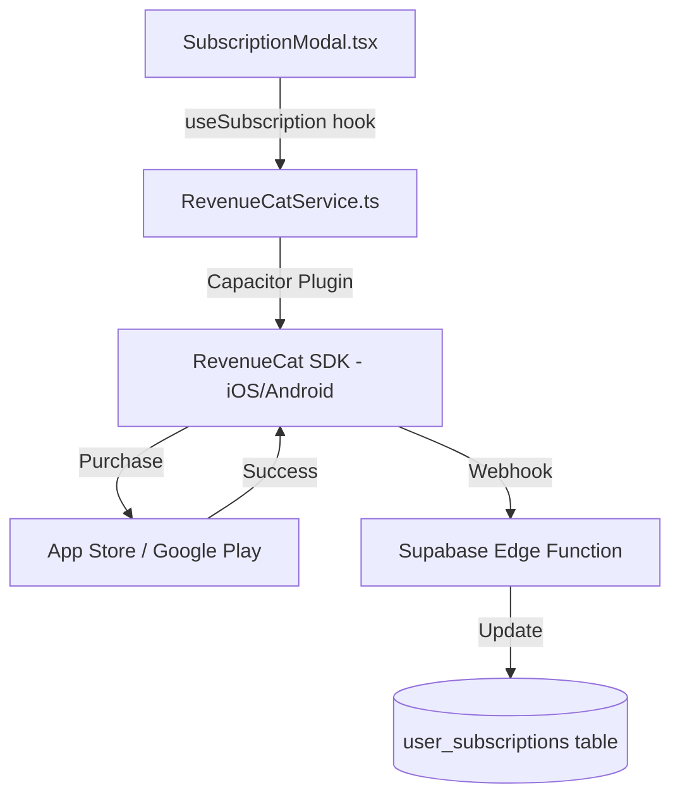

# In-App Purchase Integration Guide

This guide covers the RevenueCat integration for ONDA subscriptions.

## Architecture



## Setup Checklist

### RevenueCat Dashboard
- [ ] Project created
- [ ] iOS App added with Bundle ID: `com.onda-life.ios`
- [ ] In-App Purchase Key (.p8) uploaded
- [ ] App Store Connect API Key uploaded
- [ ] Entitlement: `ONDA Premium`
- [ ] Offering: `default` with packages

### App Store Connect
- [ ] Subscription Group: `ONDA Premium`
- [ ] Yearly subscription: `com.onda.yearly` (14-day trial)
- [ ] Monthly subscription: `com.onda.monthly` (7-day trial)
- [ ] Grace Period enabled (recommended)

### Code Files
- `src/services/RevenueCatService.ts` - SDK wrapper
- `src/hooks/useSubscription.ts` - React hook
- `src/components/SubscriptionModal.tsx` - Paywall UI
- `supabase/migrations/20260110160000_create_user_subscriptions.sql` - DB schema
- `supabase/functions/revenuecat-webhook/index.ts` - Webhook handler

## Configuration

### 1. Set API Keys

Edit `src/services/RevenueCatService.ts`:

```typescript
const REVENUECAT_IOS_API_KEY = 'appl_YOUR_KEY_HERE';
const REVENUECAT_ANDROID_API_KEY = 'goog_YOUR_KEY_HERE';
```

### 2. Apply Database Migration

```bash
# Via Supabase CLI
supabase db push

# Or manually in Supabase Dashboard SQL Editor
```

### 3. Deploy Webhook Function

```bash
supabase functions deploy revenuecat-webhook
```

### 4. Configure RevenueCat Webhook

In RevenueCat Dashboard → Integrations → Webhooks:
- URL: `https://YOUR_PROJECT.supabase.co/functions/v1/revenuecat-webhook`
- Events: All subscription events

## Usage

### Check Subscription Status

```typescript
import { useSubscription } from '../hooks/useSubscription';

function MyComponent() {
  const { isPremium, isLoading } = useSubscription();
  
  if (isLoading) return <Spinner />;
  
  return isPremium ? <PremiumContent /> : <FreeContent />;
}
```

### Purchase a Subscription

```typescript
const { purchase, getYearlyPackage, isPurchasing } = useSubscription();

const handlePurchase = async () => {
  const pkg = getYearlyPackage();
  if (pkg) {
    const success = await purchase(pkg);
    if (success) {
      // User is now premium!
    }
  }
};
```

### Restore Purchases

```typescript
const { restore, isRestoring } = useSubscription();

const handleRestore = async () => {
  const success = await restore();
  if (success) {
    // Purchases restored!
  }
};
```

## Subscription Plans

| Plan | Product ID | Price | Trial |
|------|------------|-------|-------|
| Yearly | `com.onda.yearly` | $64.99/year | 14 days |
| Monthly | `com.onda.monthly` | $14.99/month | 7 days |

## Database Schema

```sql
CREATE TABLE user_subscriptions (
    id UUID PRIMARY KEY,
    user_id UUID REFERENCES auth.users(id),
    status TEXT, -- 'active', 'expired', 'cancelled', 'billing_issue'
    product_id TEXT,
    expires_at TIMESTAMPTZ,
    is_trial BOOLEAN,
    will_renew BOOLEAN,
    ...
);
```

## Webhook Events

| Event | Status Set |
|-------|------------|
| INITIAL_PURCHASE | active |
| RENEWAL | active |
| CANCELLATION | active (will_renew = false) |
| EXPIRATION | expired |
| BILLING_ISSUE | billing_issue |

## Testing

### Sandbox Testing (iOS)

1. Create Sandbox Tester in App Store Connect
2. Sign out of App Store on device
3. Sign in with Sandbox account in Settings → App Store
4. Purchases will use sandbox environment

### Sandbox Time Compression

| Real Duration | Sandbox Duration |
|---------------|------------------|
| 1 week | 3 minutes |
| 1 month | 5 minutes |
| 1 year | 1 hour |

## Troubleshooting

### "Missing Metadata" in RevenueCat
- Wait for App Store Connect sync (can take hours)
- Check that subscriptions have localization in App Store Connect

### Purchase fails silently
- Check RevenueCat logs in dashboard
- Ensure user is logged in (RevenueCat needs app_user_id)

### Webhook not updating database
- Check Edge Function logs in Supabase
- Verify user_id matches Supabase auth.users.id
